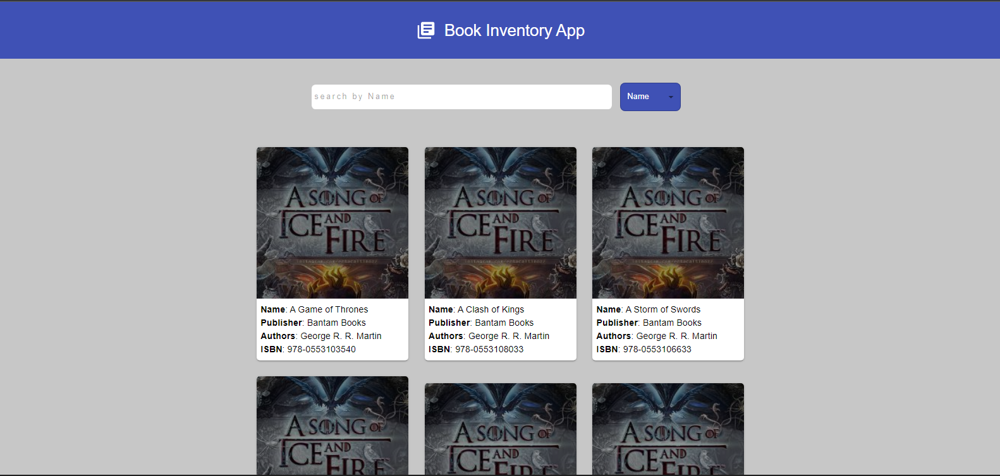

# Project Name

Book Inventory App

A book inventory application using ANAPIOFICEANDFIRE API

Live demo [_here_](https://bookinventoryapp.netlify.app/)

## Table of Contents

- [General Info](#general-information)
- [Technologies Used](#technologies-used)
- [Features](#features)
- [Screenshots](#screenshots)
- [Setup](#setup)
- [Usage](#usage)

## General Information

An app that enable users too see a list of books available on the Ice and Fire API platform. It also allow users to search for a book using the following name, publisher, isbn, authors, end date, characters name and characters culture.

## Technologies Used

- React.js - version 18.2.0
- Typescript - version 4.8.4
- material ui - version 5.10.14

## Features

- Display list of books on the Ice and Fire API platform
- It also allow users to search for a book using the following name, publisher, isbn, authors, end date, characters name and characters culture.

## Setup

This project was bootstrapped with [Create React App](https://github.com/facebook/create-react-app).

### Available Scripts

In the project directory, run:

### `npm install`

The npm install installs all modules that are listed on package.json file and their dependencies.

### `npm start`

Runs the app in the development mode.\
Open [http://localhost:3000](http://localhost:3000) to view it in your browser.

The page will reload when you make changes.\
You may also see any lint errors in the console.

### `npm run build`

Builds the app for production to the `build` folder.\
It correctly bundles React in production mode and optimizes the build for the best performance.

The build is minified and the filenames include the hashes.\
Your app is ready to be deployed!

## Usage

- The page displays a list of book available on the platform onload.
- To begin a search, use the select dropdown button beside the input field to select the option with which you want to search, then enter your search parameters in the input field.
